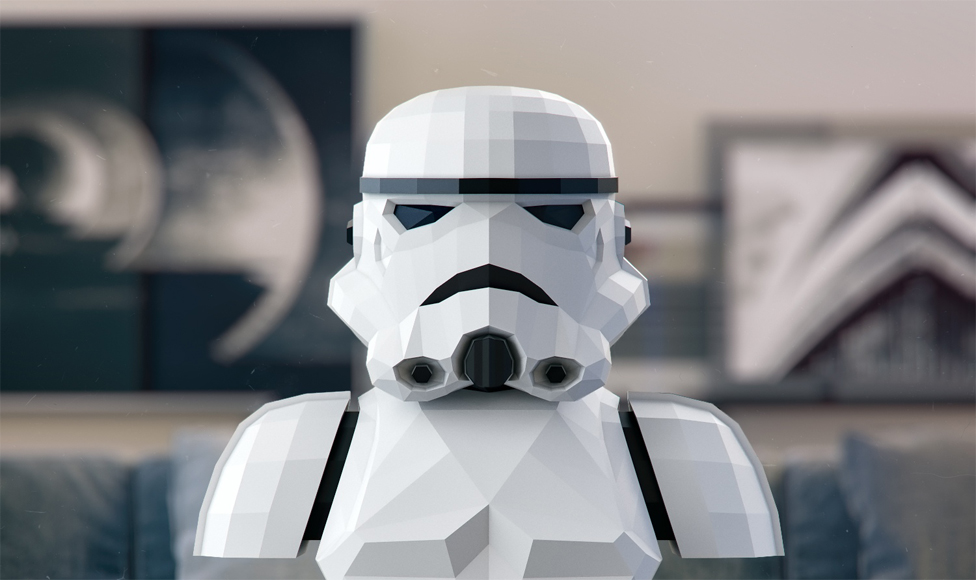
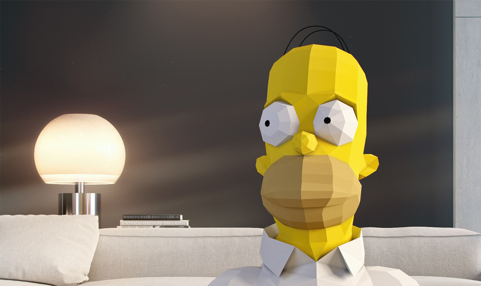
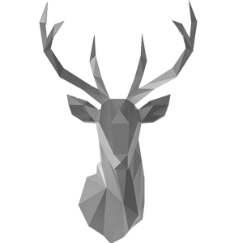
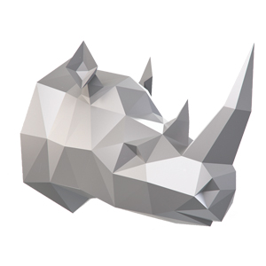
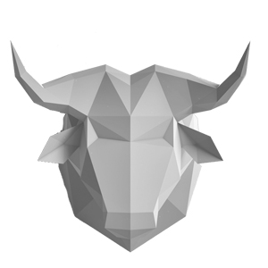

<!doctype html>
<html lang="ru">
  <head>
    <!-- Required meta tags -->
    <meta charset="utf-8">
    <meta name="viewport" content="width=device-width, initial-scale=1, shrink-to-fit=no">

    <!-- Bootstrap CSS -->
    <link rel="stylesheet" href="https://stackpath.bootstrapcdn.com/bootstrap/4.3.1/css/bootstrap.min.css" integrity="sha384-ggOyR0iXCbMQv3Xipma34MD+dH/1fQ784/j6cY/iJTQUOhcWr7x9JvoRxT2MZw1T" crossorigin="anonymous">
    <!-- подключаем свои стили для корректировки отображения на странице -->
    <link rel="stylesheet" href="css/main.css">
    <title>Изучаем Bootstrap 4</title>
  </head>
  <body>
    <!-- навигационная панель -->
      <nav class="navbar navbar-expand-lg navbar-light bg_nav_me fixed-top">
           <a class="navbar-brand" href="#">Poly Dream</a>
          <button class="navbar-toggler" type="button" data-toggle="collapse" data-target="#navbarSupportedContent" aria-controls="navbarSupportedContent" aria-expanded="false" aria-label="Toggle navigation">
            
          </button>
        
          

            <ul class="navbar-nav mr-auto">
              <li class="nav-item active">
                <a class="nav-link" href="#">О компании (current)</a>
              </li>
              <li class="nav-item ">
                <a class="nav-link" href="#onas">Советы</a>
              </li>
              <li class="nav-item">
                <a class="nav-link" href="#">Оплата и доставка</a>
              </li>
              <li class="nav-item">
                <a class="nav-link" href="#">Контакты</a>
              </li>
            </ul>
            Корзина
          

        </nav>
        <!-- ---------------------------------------------------- -->
    

      

        

            
        

        

           
        

      

      
      
    

    <!-- Карусель начало -->
     

        

          <ol class="carousel-indicators">
            <li data-target="#carouselExampleCaptions" data-slide-to="0" class="active"></li>
            <li data-target="#carouselExampleCaptions" data-slide-to="1"></li>
            <li data-target="#carouselExampleCaptions" data-slide-to="2"></li>
          </ol>
          

            

              
              

                <h5>ПОЛИГОНАЛЬНЫЕ СКУЛЬПТУРЫ</h5>
                
Мы проектируем полигональные скульптуры из бумаги.
 
                    
Своими руками мы превращаем виртуальные модели в конструктор.

                    
Благодаря этому, любо человек может украсить свой интерьер уникальным элементом дизайна.

                        
 Наши проекты доступны в следующих трех форматах.

              

            

            

              
              

                
              

            

            

              
              

                
              

            

          

          <a class="carousel-control-prev" href="#carouselExampleCaptions" role="button" data-slide="prev">
            
            Previous
          </a>
          <a class="carousel-control-next" href="#carouselExampleCaptions" role="button" data-slide="next">
            
            Next
          </a>
        

      

    <!-- карусель окончание -->
    <!-- карточки товаров начало -->

    
Раздел в котором описано кто мы такие

    
    

  <!-- 1-z карточка -->
  

      
      

        <h5 class="card-title">Готовые изделия</h5>
        
Мы можем изготовить любую скульптуру на заказ из бумаги, или подготовить чертежи для наших партнеров,которые соберут модель из металла, пластика или полистерола.

        <a href="#" class="btn btn-primary">Перейти в магазин</a>
      

    

  <!-- 2-z карточка -->
  

        
        

          <h5 class="card-title">Наборы для склейки</h5>
          
Прекрасный выбор для себя и в подарок. В набор входят материалы для создания скульптуры: выкройка на дизайнерской бумаге; картон для основания; клей; канцелярский нож; линейка; инструкция.

          <a href="#" class="btn btn-primary">Перейти в магазин</a>
        

      

        <!-- 3-z карточка -->
  
      

          
          

            <h5 class="card-title">Файлы</h5>
            
Для тех, кому интересно собрать полигональную скульптуру полностью самостоятельно, начиная с поиска типографии для печати, подходящего клея и бумаги. При покупке вы получите схемудля печати в формате PDF и инструкцию по сборке.

            <a href="#" class="btn btn-primary">Перейти в магазин</a>
          

        

         
    

    
  

  
    

      
Раздел в котором описано кто мы такие

      

        <h1>Советы по сборке</h1>
        

            

         
          

            
              
Не спешите

             
              
Мы постарались сделать всё возможное, чтобы процесс сборки был простым и понятным, тем не менее вам потребуется от 4 до 10 часов чтобы собрать одну модель. Не пытайтесь успеть сделать всё сразу. Мы советуем растянуть процесс сборки на два-три вечера, тогда результат получится аккуратнее, а вы получите удовольствие от сборки.

          

          

              
Внимательность и аккуратность

            
              
Для сборки модели не обязательно обладать специфическими навыками работы с бумагой, главное — ваши внимательность и аккуратность. Детям до 12 лет потребуется помощь взрослых для сборки модели.

          

          

              
Выбор бумаги

      
              
Результат напрямую зависит от качества используемых материалов. Пожалуйста, не пытайтесь собрать модель из обычной офисной бумаги. В наших наборах используется качественная бумага с оптимальным соотношением хлопка и целюллозы в составе, благодаря чему она не сильно крошится и расслаивается на сгибах. У этой бумаги есть лёгкая фактура, поэтому места склейки меньше бросаются в глаза на завершённой работе. Если вы покупаете бумагу самостоятельно, советуем вам выбрать фактурную бумагу плотностью 180-250 гр./м².

            

            

                
Выбор клея

             
              
              
В наши наборы для склейки входит клей, произведённый специально по нашему заказу. Он схватывает менее чем за 10 секунд, но этого времени достаточно для корректировки стыка. Время схватывания играет большую роль, потому что на одной модели около 120 мест склейки. Наш клей легко смывается водой с рук. Прозрачный после высыхания. Обратите внимание, что большинство клеев ПВА не подходят для этой деятельности, они долго сохнут и деформируют бумагу. При покупке файлов рекомендуем использовать для сборки резиновый клей, универсальный суперклей Момент, клей для обойных стыков, UHU Twist & Glue или клей Момент Кристалл.

              

                

              
Скульптуры можно красить

            
              
Но не любой краской. От некоторых видов автомобильной краски в баллоне бумага может деформироваться. Лучше использовать акриловую краску в баллоне или любую другую краску не на водной основе.

              
          

        

        

      
Раздел в котором описано кто мы такие

      

          

        <h1>Доставка</h1>
        
        

          

              
                
Готовые изделия

                
              
Ссылка на скачивание файлов появится автоматически сразу после оплаты заказа. Кроме того, в течение 2 часов на указанный при покупке email придёт письмо со ссылкой на скачивание файлов.

          

          

              
              
Наборы для склейки

              
По Белоруссии: Ориентировочный срок доставки в региональные центры 3-5 дней. Максимальный срок доставки: 10 дней. Доставка осуществляется из Гомеля.

                  Почтой Беларуси. Единая цена по Белоруссии : 8 бел.руб. 
                   Стоимость рассчитывается автоматически при оформлении заказа. Адреса пунктов выдачи можно посмотреть по ссылке.
                  Курьером стоимость от 15 бел.руб.
                   

          

          

        
Файлы

              
Модели делаются только на заказ. Срок изготовления модели из бумаги  2-5 дней. Сроки изготовления моделей из других материалов обсуждаются индивидуально.

                  Для доставки модель крепится к стенке коробки так, чтобы она была жёстко зафиксирована. Таким образом, модели приезжают в идеальном состоянии. Время доставки готовых изделий 7-10 дней по Белоруссии. Стоимость 80-100 бел. руб.

            
                 
         
   
         

    <!-- Optional JavaScript -->
    <!-- jQuery first, then Popper.js, then Bootstrap JS -->
    
    
    
  </body>
</html>
